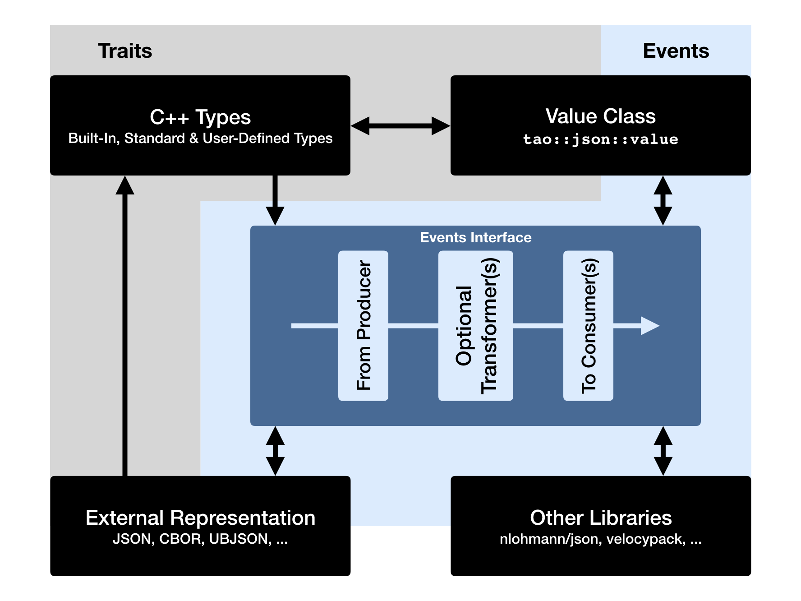

# Overview

## Value Generic Parts

At the heart of the value generic parts of this library are the [JSON Value class](Value-Class.md) that can store and manipulate arbitrary (extended) JSON data, and the [JSON Events interface](Events-Interface.md) that is the universal adapter that connects all value generic parts within the library (and can even bridge to other libraries).

The [Events interface](Events-Interface.md) is mainly used to convert the JSON Value class from and to all supported (or custom) JSON representation formats.
It can also be used to convert between formats on-the-fly, i.e. without creating a JSON Value to intermediately store the represented data, and it can modify, verify and filter arbitrary JSON data on-the-fly.

## Custom Type Traits

The [type traits](Type-Traits.md) mechanism allows the library to seamlessly interoperate with arbitrary (custom) C++ types, and the "binding" parts allow the creation of type traits for custom C++ classes with very little code.
Once the library know which data members a class has it can automatically synthesise all required traits functions at compile time.

A wide range of standard data types is supported out-of-the-box, including tuples, shared pointers, and the most frequently used standard library containers.
When greater control over the conversion between custom type and JSON Value or JSON Events is required, or when the behaviour for existing types needs to be changed, the traits mechanism allows for full manual control over all details.

## Value Specific Parts

The value specific parts of the library can be used to directly and efficiently convert all supported (or custom) JSON representation formats from and to instances of arbitrary (custom) types.
C++ classes can be easily encoded as Arrays or Objects, with control over whether empty data members are omitted, whether to throw an exception when decoding unknown Object fields, and which fields are required and which are optional.

The traits specialisations created by the "binding" parts fully support the value specific parts of this library.
The value specific parts also support advanced use cases like polymorphic object factories, inheritance of data members, and multiple encoding schemes for the same data type.

## Hybrid Value Model

The [hybrid value model](Advanced-Use-Cases.md#instance-sharing-with-opaque-pointers) allows for pointers to (custom) types to be embedded in JSON Value objects and is also supported by the automatically generated "binding" traitss.

Copyright (c) 2018 Dr. Colin Hirsch and Daniel Frey
